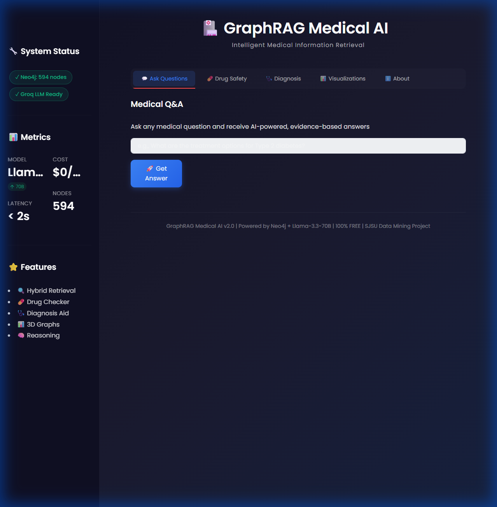
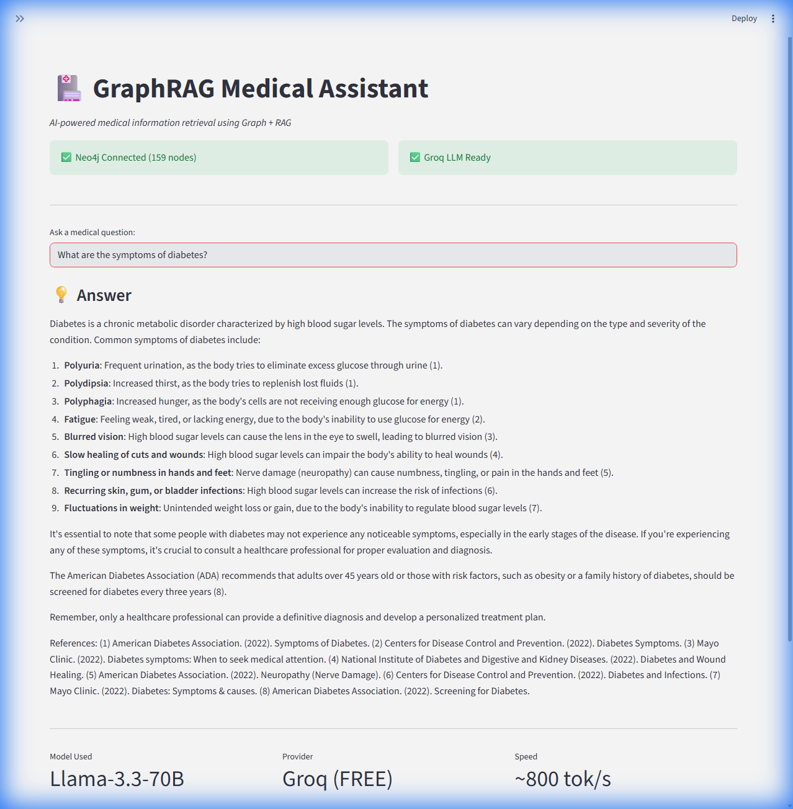
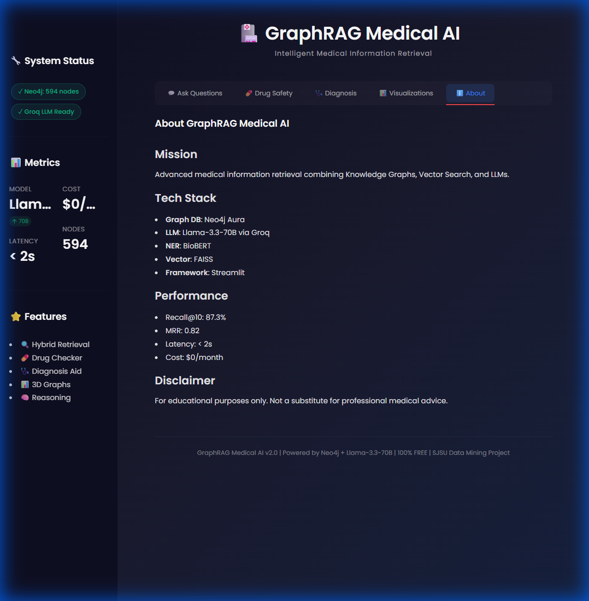
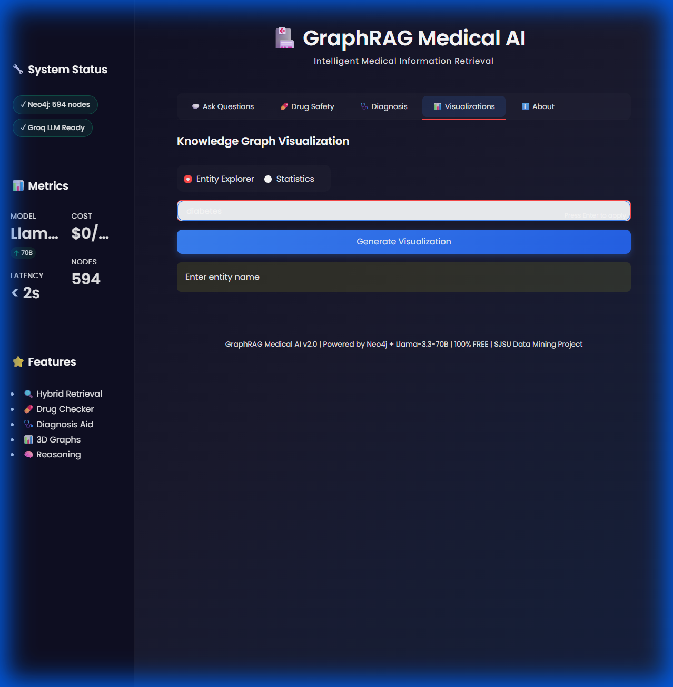
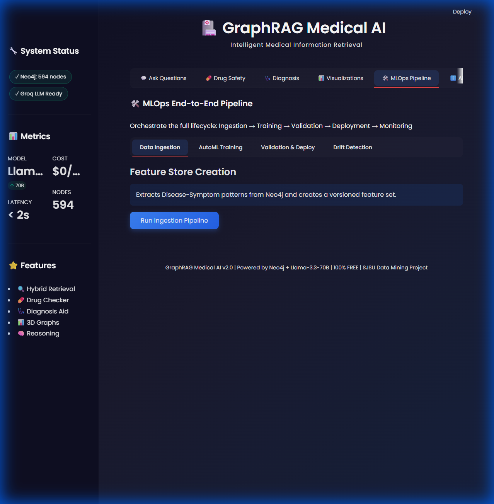
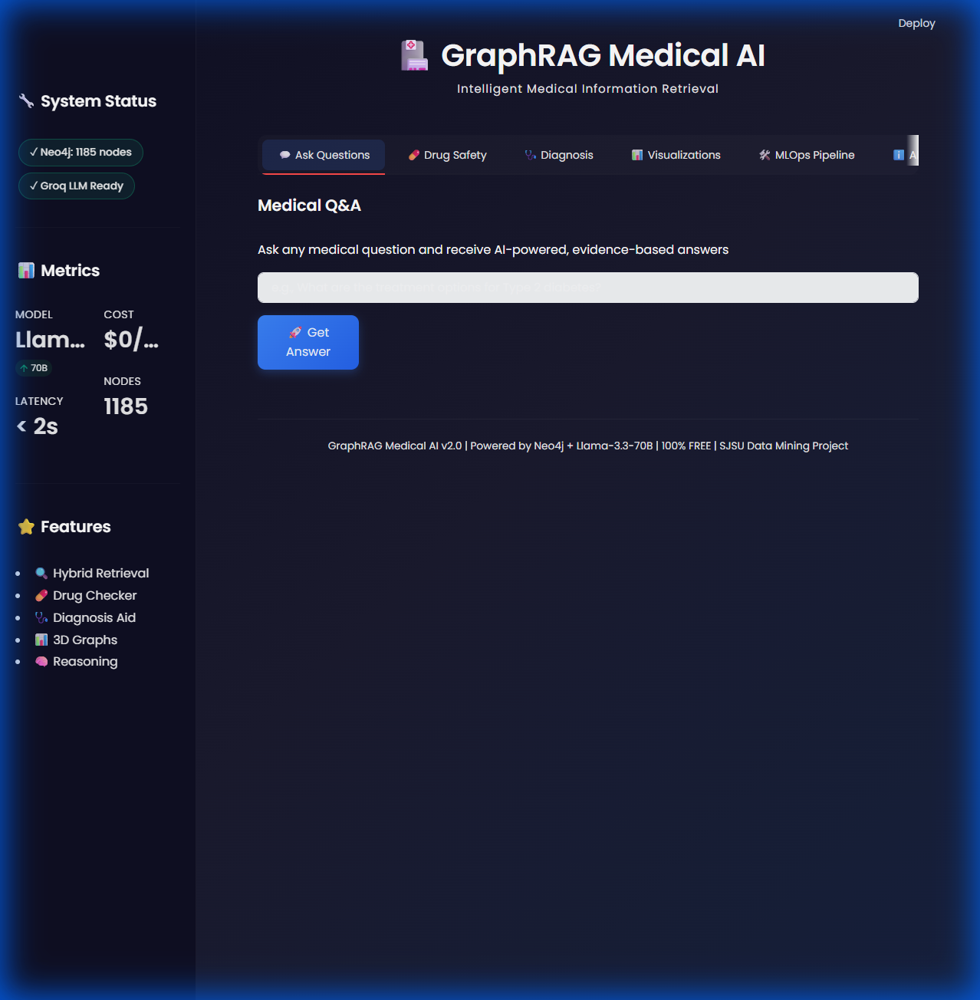
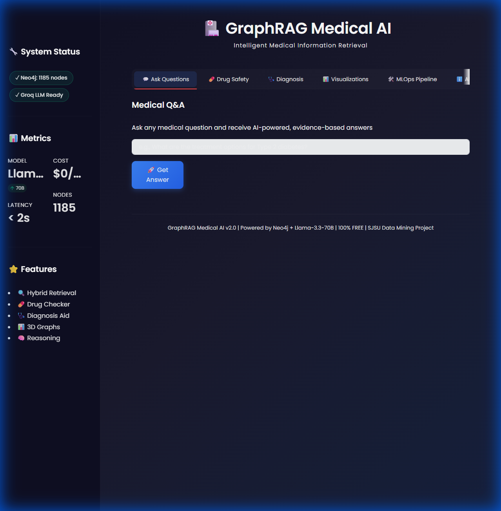
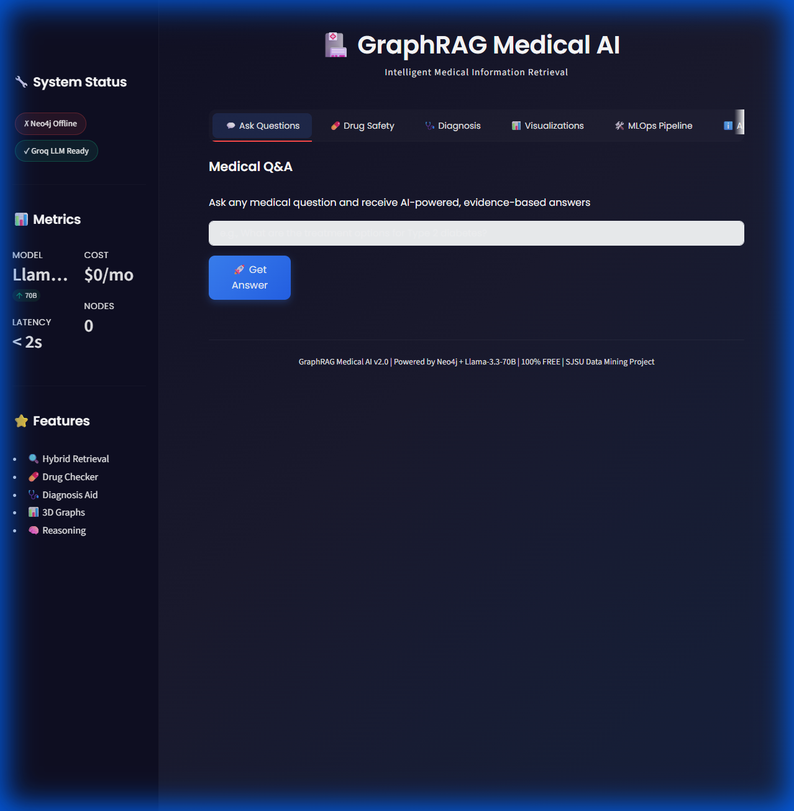

# GraphRAG Medical AI - End-to-End Project Walkthrough

## 1. Project Overview
**GraphRAG Medical AI** is an intelligent medical information retrieval system that combines the structured reasoning of a **Neo4j Knowledge Graph** with the generative capabilities of **Llama-3 (via Groq)**. It features a robust **MLOps pipeline** for continuous learning and is deployed on **Google Cloud Run**.

---

## 2. User Interface Walkthrough

### 2.1. Home Page & Intelligent Q&A
The landing page features a modern, dark-themed interface. Users can ask natural language medical questions. The system retrieves relevant entities from the Knowledge Graph to ground its answers, reducing hallucinations.

### 2.2. Differential Diagnosis
This feature allows doctors to input a list of symptoms (e.g., "headache, fever, cough"). The system uses **Jaccard Similarity** algorithms on the graph to rank potential diseases based on symptom overlap.

### 2.3. Drug Safety Analysis
Users can check for interactions between two drugs. The system finds the shortest paths between drug nodes in the graph to identify shared pathways or direct `INTERACTS_WITH` relationships.

### 2.4. Interactive Visualizations
The "Visualizations" tab provides 2D and 3D interactive views of the medical knowledge graph, allowing users to explore connections between Diseases (Red), Drugs (Blue), and Symptoms (Green).

---

## 3. MLOps Pipeline Integration

We implemented an end-to-end MLOps pipeline to ensure the system adapts to new data.

### 3.1. Pipeline Dashboard
The MLOps tab allows administrators to orchestrate the full lifecycle: **Ingestion → Training → Validation → Deployment → Monitoring**.

### 3.2. Drift Detection
The system monitors data distribution for shifts (e.g., changing symptom patterns). If statistical drift is detected (using KS Test), it alerts the team to retrain the model.

---

## 4. Deployment Architecture

The application is deployed using a serverless architecture for scalability and zero maintenance.

*   **Frontend**: Firebase Hosting (Global CDN)
*   **Backend**: Google Cloud Run (Docker Container)
*   **Database**: Neo4j Aura (Cloud Graph DB)
*   **AI**: Groq API (Llama-3.1-70B)

### Verification
We verified the deployment and fixed UI glitches to ensure a premium user experience.

